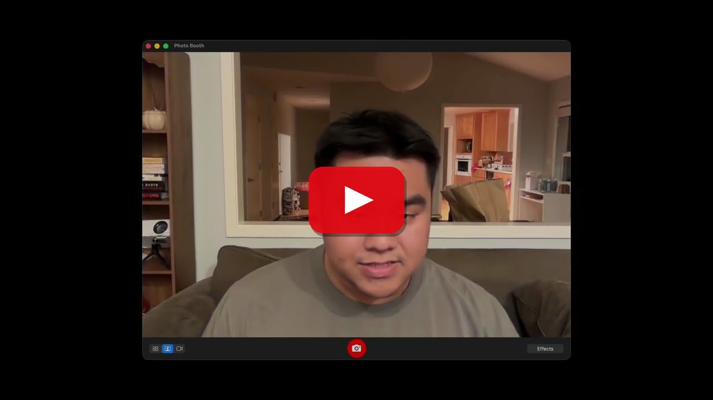

# Track 3: Native PhysX on RDNA3 for Sim2Real

**Binh Pham**

Running ManiSkill's GPU-parallel robot simulation on AMD by porting the PhysX 5 GPU rigid-body
solver from CUDA to HIP, then training a vision-based policy end to end on a Radeon and deploying it
to a physical robot.

[](https://www.youtube.com/watch?v=jH5PWRnx3-Q)

_**Click the image to watch the demo on YouTube.**_

## Submission contents

| | |
| --- | --- |
| **Technical report** | [`TECHNICAL_REPORT.md`](TECHNICAL_REPORT.md) |
| **Reproducibility guide** | [`REPRODUCE.md`](REPRODUCE.md), from provisioning a Radeon to a benchmark JSON |
| **Demo video** | https://www.youtube.com/watch?v=jH5PWRnx3-Q |
| **Source code** | https://github.com/pham-tuan-binh/ManiSkill |
| **Downstream project** | [`so-frame`, `amd` branch](https://github.com/livekit-examples/so-frame/tree/amd) |
| **Prior work** | [SO-Frame sim2real, established on NVIDIA before this port](https://x.com/pham_blnh/status/2083319521348362747) |

## Results

| | Result |
| --- | --- |
| **Throughput** | 67,320 env-steps/s at 4096 envs, **60% of an RTX 5090**, ratio flat across three orders of magnitude |
| **Numerical correctness** | 15/15 validation on both platforms; GPU-vs-CPU divergence **identical to NVIDIA's to three significant figures** |
| **Policy transfer** | An AMD-trained policy scores **98.4%** on NVIDIA's stock CUDA PhysX |
| **Sim2real** | A vision-based policy trained entirely on a Radeon **drives the physical SO-101 rig** |
| **Scope** | 257 of 509 PhysX GPU kernels ported; ManiSkill itself **unmodified** |
| **Energy** | NVIDIA is 1.43× more efficient; AMD delivers 60% of throughput inside 42% of the power budget |

Validated on a Radeon PRO W7900 (`gfx1100`, RDNA3), ROCm 7.2.1, Ubuntu 24.04, against a stock
unpatched ManiSkill on an NVIDIA RTX 5090.

## Reproducing it

Budget about three hours, most of it unattended compilation. Full instructions, including
provisioning a GPU on AMD Radeon Cloud from scratch, are in [`REPRODUCE.md`](REPRODUCE.md).

```bash
git clone https://github.com/pham-tuan-binh/ManiSkill.git && cd ManiSkill
./tools/amd_port/bootstrap.sh --prebuilt --fix-torch-rocm --venv benchmarks/amd/.venv
source ~/maniskill-amd/env.sh
./tools/amd_port/verify.sh          # 15/15 correctness, GPU liveness checked first
cd benchmarks && uv run amd         # throughput + power -> results/amd-latest.json
```

## Media

| File | What it is |
| --- | --- |
| [`assets/rig.jpeg`](assets/rig.jpeg) | The physical SO-Frame rig |
| [`assets/sim_amd.mp4`](assets/sim_amd.mp4) | Rollouts in simulation on the Radeon (20 s) |
| [`assets/real_rollout.mp4`](assets/real_rollout.mp4) | The AMD-trained policy on the physical rig (56 s) |
| [`assets/train.png`](assets/train.png) | Training curves, AMD against the NVIDIA baseline |
| [`assets/throughput.png`](assets/throughput.png) | Throughput and scaling efficiency |
| [`assets/correctness.png`](assets/correctness.png) | GPU-vs-CPU divergence per task |
| [`assets/policy-transfer.png`](assets/policy-transfer.png) | Policy transfer across four backends |
