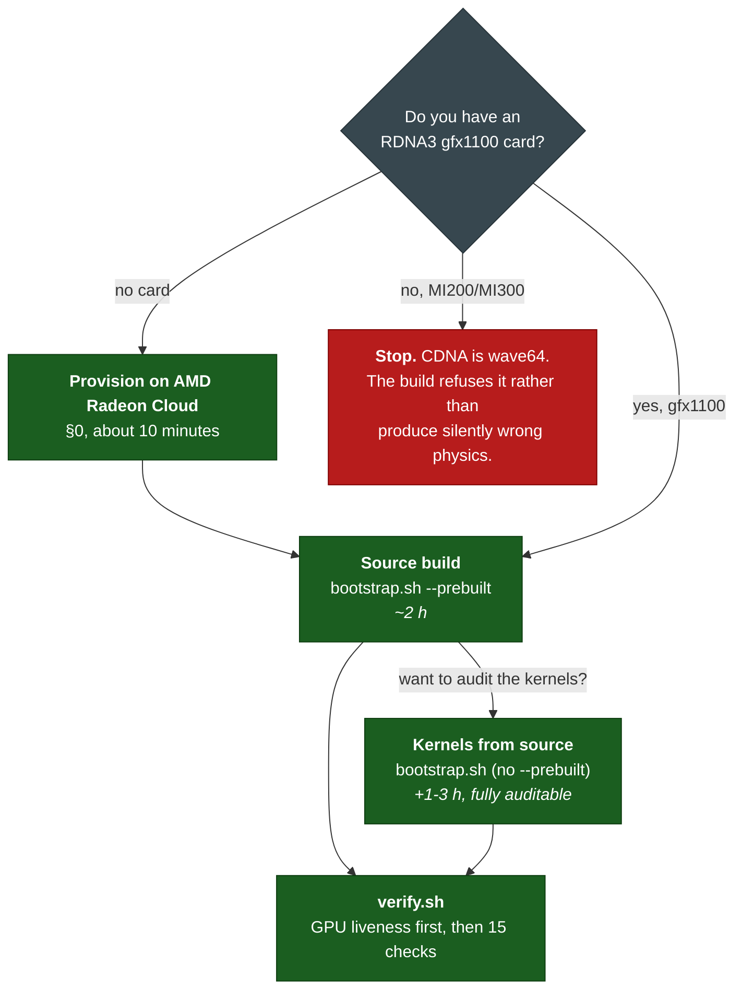

# Reproducing this port

Everything you need to reproduce the results in [`TECHNICAL_REPORT.md`](TECHNICAL_REPORT.md).

> ### Budget about 3 hours
>
> |                                                |          |
> | ---------------------------------------------- | -------- |
> | Provisioning a Radeon on AMD Radeon Cloud (§0) | ~10 min  |
> | `bootstrap.sh`, the build (§1)                | **~2 h** |
> | `verify.sh` + the benchmarks (§1, §4)          | ~30 min  |
>
> Most of that is unattended compilation. `bootstrap.sh` stamps each of its seven stages, so an
> interrupted run resumes where it stopped rather than starting over, but start it in `tmux` or
> over SSH rather than in a browser terminal. Compiling the GPU kernels from source instead of
> using the shipped ones adds 1-3 hours on top, and is optional.

I wrote this for someone who has not seen the project before, and who may not have an AMD card at
all. §0 walks through provisioning one on **AMD Radeon Cloud** from scratch. If you only do one
thing after that, run the build in §1 and then `verify.sh`, which is the difference between measuring
GPU physics and measuring something that only looks like it.

There is one path, the source build, because that is the path I actually run and every number in
the report came from it.



---

## 0. What you need

|                   | Requirement                                                            | Notes                                                                            |
| ----------------- | ---------------------------------------------------------------------- | -------------------------------------------------------------------------------- |
| **GPU**           | AMD **RDNA3**, wavefront 32, validated on Radeon PRO W7900 (`gfx1100`) | A 7900 XTX is the same `gfx1100` target                                          |
| **Not supported** | **CDNA (MI200/MI300, `gfx90a`/`gfx942`)**                              | wave64. The build **refuses** rather than produce silently wrong physics |
| **OS**            | Ubuntu 24.04 (kernel 6.8 validated)                                    |                                                                                  |
| **ROCm**          | 7.2.1 at `/opt/rocm`                                                   | Must include `/opt/rocm/llvm/bin/clang++`                                        |
| **Disk**          | ~60 GB                                                                 |                                                                                  |
| **RAM**           | 16 GB minimum                                                          |                                                                                  |

ROCm is the only prerequisite you have to install yourself. For the NVIDIA reference half of the comparison: any CUDA 12.8-capable GPU (I used an RTX 5090).
Nothing is patched on that side. It is stock ManiSkill.

### Provisioning a GPU on AMD Radeon Cloud

I developed and validated this on **AMD Radeon Cloud**, which is the easiest way to get a gfx1100
card if you do not own one. This section is a complete walkthrough: from no account to a shell on a
Radeon, in about ten minutes.

The platform's own documentation is the
**[Radeon Cloud User Guide](https://github.com/AMD-DEV-CONTEST/Radeon-hackathon-2026-07/blob/main/Radeon-Cloud-User%20Guide/README.md)**,
and the steps below are tagged to its sections. Read this page rather than that one where they
differ: the choices here are the ones this build needs, and three of them cannot be changed after
the instance is launched.

**Step 0. Log in.** Go to [radeon-global.anruicloud.com](https://radeon-global.anruicloud.com/),
click **Login** (top right), and choose **Login with Email**.
_(Guide: Step 0 · Login.)_

**Step 1. Open your Profile.** Click your avatar in the top-right corner → **Profile**. Everything
that follows lives on this page.
_(Guide: Step 1 · Click Profile.)_

**Step 2. Add your SSH public key.** In Profile, paste the contents of your `~/.ssh/id_ed25519.pub`
into the **SSH Public Key** box and click **Save Key**. Generate one first if you need to:

```bash
ssh-keygen -t ed25519 -C "your_email@example.com"
cat ~/.ssh/id_ed25519.pub          # paste this -- never the file without .pub
```

Do this _before_ creating the template. A JupyterLab terminal also works and needs no key, but the
build here runs for about two hours, and a browser terminal is a bad place to keep it.

**Step 3. Create a template.** In **My Templates**, click **Add Template**. Three fields matter:

| Field                     | Set it to           |
| ------------------------- | ------------------- |
| **Title**                 | anything            |
| **Container Image**       | **GH-proxy-stable** |
| **SSH Access (advanced)** | **on**              |

Click **Add Template**.

**Step 4. Launch it.** Back in **My Templates**, click **Launch** on your template's row and wait
for **Your workspace is ready (100%)**.

**Step 5. Connect.** The ready dialog, and the **Active Instance** section of Profile, show a
copy-ready SSH command with the host, port and username:

```bash
ssh <user>@<host> -p <port>        # type "yes" at the fingerprint prompt
```

If `sshd` is not running on the image, open a JupyterLab terminal (**Open Notebook** → Terminal) and
start it once:

```bash
sudo apt update && sudo apt install -y openssh-server
mkdir -p /run/sshd && /usr/sbin/sshd
```

**Step 6. Confirm you got the right card, before building anything.** `bootstrap.sh` refuses
wave64, but check first rather than an hour into a build:

```bash
rocminfo | grep -m1 gfx            # expect gfx1100
cat /opt/rocm/.info/version        # expect 7.2.x
```

`gfx90a` or `gfx942` means you were given a CDNA card. Destroy the instance and relaunch. This port
does not support it, for the reason in §0's table.

**Step 7. Fix DNS before you build.** Do this even though nothing looks broken. The stock
`/etc/resolv.conf` points at a nameserver unreachable from the region and sets `ndots:5` with
Kubernetes search domains, so any name with fewer than five dots tries `*.svc.cluster.local` first
and times out three times before the real query. A cold lookup takes **5.24 s** on a link that
actually does **43 MB/s**, which makes every clone and every `uv` operation look network-bound when
it is not:

```bash
cat > /etc/resolv.conf <<'EOF'
nameserver 223.5.5.5        # or any resolver reachable from your region
nameserver 119.29.29.29
options ndots:1 timeout:2 attempts:2
EOF
# measured: DNS 5.238 s -> 0.019 s
```

`bootstrap.sh` times a lookup at stage 0 and warns above 1 s. It never fails, because the build
works either way and is just an order of magnitude slower. Note that `/etc/resolv.conf` is often
regenerated when a container restarts, so re-apply this after one.

**Step 8. Clone the repository.** Everything below runs from inside it:

```bash
cd /root
git clone https://github.com/pham-tuan-binh/ManiSkill.git
cd ManiSkill
ls tools/amd_port/bootstrap.sh                        # sanity check: this must exist
```

The clone is ~500 MB and pulls no submodules; `bootstrap.sh` fetches PhysX, SAPIEN and svulkan2
itself at their pinned revisions (§3).

Then go to §1. It is four commands from here.

> **One consequence worth knowing up front:** a Radeon Cloud instance is itself an unprivileged
> container, so it cannot build or run Docker images (`unshare: operation not permitted`, and bind
> mounts fail). This repository ships Dockerfiles, but there is no container-based reproduction path
> here and none was ever executed on AMD hardware.

---

## 1. The source build

This is the path I run, and every number in the report came from it. About **2 hours** with the
prebuilt kernels; add 1-3 hours to compile them from source instead.

Four commands, from a box that has ROCm and nothing else to a JSON file of benchmark numbers. Run
them from inside the clone (§0 Step 8):

```bash
git clone https://github.com/pham-tuan-binh/ManiSkill.git && cd ManiSkill

# 1.1 Build the port AND create the environment it installs into. Missing system packages,
#     uv, and the benchmark venv (torch 2.5.1+rocm6.2 + this repo's ManiSkill, resolved from
#     the committed lockfile) are all handled here -- there is nothing to install first.
./tools/amd_port/bootstrap.sh --prebuilt --fix-torch-rocm --venv benchmarks/amd/.venv

# 1.2 Runtime environment. One variable plus the interpreter that was built into; the kernel
#     objects are found automatically.
source ~/maniskill-amd/env.sh

# 1.3 Verify. Do not skip -- this is the step that proves the GPU is genuinely in use.
./tools/amd_port/verify.sh

# 1.4 The numbers.
cd benchmarks && uv run amd
```

That sequence was run end to end on a fresh machine. Two notes on
what changed as a result, because both used to be manual steps:

- **`--venv` no longer has to exist.** Pointed at the `.venv` of a uv project, stage 0 syncs that
  project. The old first two steps (`apt-get install ...`, then `uv sync`) existed only because
  `uv sync` needs `uv`, which bootstrap installs anyway.
- **`verify.sh` needs no `--venv`.** `env.sh` records the interpreter the build installed into, so
  sourcing it is enough. Passing `--venv` still works and still wins.

`bootstrap.sh` runs seven stages, each stamped in `$PREFIX/.stamps`, so an interrupted run resumes
instead of restarting. Re-run one stage with `--force-stage N`.

| Stage | What it does                                                                                                                                                             |
| ----- | ------------------------------------------------------------------------------------------------------------------------------------------------------------------------ |
| 0     | Preflight: install missing prerequisites, create/sync the target environment, route git through a mirror if github is unreachable, time DNS, and **refuse wavefront 64** |
| 1     | Clone PhysX at the pinned SHA, apply `physx-amd-hip.patch` (84 files)                                                                                                    |
| 2     | Build PhysX host libraries with `PX_GPU_EXTERNAL_HIP=ON` _(long)_                                                                                                        |
| 3     | GPU kernels: unpack prebuilt, or compile 257 with `hipcc` _(long)_                                                                                                       |
| 4     | Assemble the PhysX 5 SDK tree SAPIEN expects                                                                                                                             |
| 5     | Clone SAPIEN, apply `sapien-amd-hip.patch` (33 files), pin svulkan2, build _(long)_                                                                                      |
| 6     | Build an ABI-matched `pysapien`, set RPATH, then hand off to `install-into.sh`                                                                                           |
| 7     | Confirm the PyTorch/ROCm library conflict is resolved                                                                                                                    |

Stage 6 **calls `install-into.sh`** rather than installing by hand. That is not tidiness: the two
had drifted, and the copy in bootstrap was missing the `~/.sapien` seeding, which fails only at the first GPU
environment and blames the network when it does.

### The NVIDIA reference half

Nothing is patched on that side, so there is nothing to build. On a CUDA box:

```bash
cd benchmarks && uv run nvidia
```

Stock ManiSkill from PyPI with a CUDA torch, deliberately unpatched, because it is the reference.
The benchmark JSON records the resolved ManiSkill import path, so you can check that one side used
upstream and the other used this repository.

> **On containers.** This repository ships `docker/Dockerfile.{amd,nvidia}` and both images build,
> but **`docker run` with an AMD GPU attached has never been executed**. A Radeon Cloud instance is
> an unprivileged container and cannot run Docker, and the NVIDIA reference box has no Radeon. There
> is deliberately no container reproduction path in this guide: everything documented here is a path
> I have run on hardware.

---

## 2. Integrating the port into another project

The most useful property of this port: **the physics work requires no ManiSkill changes.** It lives
entirely in PhysX and SAPIEN, so your project can depend on **upstream ManiSkill from PyPI** and
still get GPU physics on AMD. There is no fork to track.

```bash
# in your project, with its own environment and its own dependencies
uv add mani_skill==3.0.1            # or pip install -- upstream is fine

# torch from the ROCm index whose MAJOR matches your SYSTEM ROCm. Check yours first:
cat /opt/rocm/.info/version         # e.g. 7.2.1  -> use the rocm7.1 index (torch >= 2.10)
                                    #      6.x    -> use rocm6.3 / rocm6.4
uv add torch==2.13.0 --index https://download.pytorch.org/whl/rocm7.1

# drop the AMD-capable physics underneath it
/path/to/ManiSkill/tools/amd_port/install-into.sh .venv --fix-torch-rocm
```

`install-into.sh` copies this port's SAPIEN and HIP PhysX libraries over the ones your `sapien`
package shipped, puts the kernel code objects where the loader finds them, patches the installed
wheel's Python files, and then **verifies the GPU is genuinely in use** before reporting success. It
is idempotent, so re-run it after any `uv sync` that reinstalls `sapien`.

It needs `bootstrap.sh` to have been run once, so the libraries exist.

**Three things to get right, in the order they will bite you.**

**1. Match the ROCm major, AND apply `--fix-torch-rocm`. You need both.** This port's libraries link
the _system_ ROCm. A torch wheel built for a different ROCm major puts a second HIP runtime in the
process, and the two cannot coexist. torch's bundled `libamdhip64.so` has SONAME `libamdhip64.so.6`
where a ROCm 7 system's is `.so.7`. You then get a choice of two failures:

| torch's ROCm libraries           | GPU physics                                                                    | `import torchvision`                         |
| -------------------------------- | ------------------------------------------------------------------------------ | -------------------------------------------- |
| left in place                    | ✗ `undefined symbol: hsa_amd_memory_get_preferred_copy_engine, version ROCR_1` | ✓                                            |
| moved aside (`--fix-torch-rocm`) | ✓                                                                              | ✗ `operator torchvision::nms does not exist` |

I tested all five subsets of that move. There is no middle ground, and PyTorch published **no ROCm 7
wheels before torch 2.10**, so on a ROCm 7 machine any older wheel forces that table.

Matching the majors is necessary but **not sufficient**. torch still ships its own
`libamdhip64.so` with SONAME `libamdhip64.so.7`, and so does the system; two copies of one soname
in a process make HIP abort with `hip.cpp:512] hipApiName has non-null function pointer`, seen as a
hard abort during scene reconfiguration. So still pass `--fix-torch-rocm`. What the alignment buys
is that the fix becomes **safe for torchvision**, because the system's `.so.7` then satisfies the
soname `_C.so` needs. Verified: with torch 2.12.1+rocm7.1 and the fix applied, GPU physics,
`obs_mode="rgb"` and `import torchvision` all hold simultaneously.

**2. Your Python minor must match the one the port was built for, or rebuild the module.**
`pysapien` is a CPython extension, so a `pysapien.cpython-312` module simply does not load into a
Python 3.10 environment. Nothing errors. `cp` succeeds, the interpreter ignores the wrong ABI tag,
your **stock CUDA-linked** `sapien` stays in charge, and you get `failed to find device "cuda"`,
an error whose documented causes are all unrelated. `install-into.sh` refuses this rather than
letting it happen. To retarget the module to your interpreter:

```bash
PREFIX=<your prefix> /path/to/ManiSkill/tools/amd_port/bootstrap.sh \
    --force-stage 6 --venv /path/to/your/.venv     # ~2 minutes; rebuilds only `pysapien`
```

Prefer that over changing your project's Python. ROCm torch wheels are cp-tagged and several GB, so
moving 3.10 → 3.12 re-downloads everything and reuses nothing from the uv cache.

**3. `uv sync` reinstalls `sapien` and silently restores the stock CUDA libraries.** Re-run
`install-into.sh` after any sync. This is the single most likely thing to cost you an afternoon.

Rendering works, so `obs_mode="rgb"` and visual-policy training are supported. See §4.4 of the
report for its three limits.

**A worked example** is the [`amd` branch of `so-frame`](https://github.com/livekit-examples/so-frame/tree/amd) (`rl/environments/maniskill`), a vision-based
SAC/DINO training project. Its only changes from `main` are dependency pins, with no project source
changes, and `mani_skill` stays the unmodified 3.0.1 release. Verified on hardware: GPU physics plus
`obs_mode="rgb"` returning `(4,128,128,3)` uint8 on `cuda:0` with 220 distinct values. See
`README-AMD.md` on that branch.

---

## 3. Dependencies

### Pinned upstream revisions

The patches carry context from these exact trees. **All three matter, and the third is a trap**,
SAPIEN's own gitlink points elsewhere, and `git apply` cannot fix submodule content.

```
PhysX     7845321d31fa3619917ebe127ab5e08e73de0bdb   github.com/NVIDIA-Omniverse/PhysX
SAPIEN    8c5643df19798501295a781167ef886da23a6857   github.com/haosulab/SAPIEN
svulkan2  74d6529a6a213bfb84dee75035600b79eb7c3c44   github.com/haosulab/sapien-vulkan-2
```

### Python

Resolved from committed `uv.lock` files, so you get the same dependency set I did:

|           | AMD (`benchmarks/amd`)           | NVIDIA (`benchmarks/nvidia`)   |
| --------- | -------------------------------- | ------------------------------ |
| ManiSkill | `editable = "../.."` (this repo) | `registry = pypi.org`, `3.0.1` |
| torch     | `2.5.1+rocm6.2`                  | `2.11.0+cu128`                 |
| Python    | `>=3.10,<3.13`                   | `>=3.10,<3.13`                 |

Both Python bounds are load-bearing: ManiSkill 3.0.1's `mplib` dependency ships only cp310-cp312
wheels, and torch 2.5.1+rocm6.2 has no 3.13 build.

### Single source of truth

Every pinned version and build flag lives in
[`tools/amd_port/port-manifest.sh`](tools/amd_port/port-manifest.sh), with each entry annotated by what
makes it load-bearing. To confirm nothing has drifted between the manifest, the
docs, the lockfiles and the Dockerfile:

```bash
./tools/amd_port/check-consistency.sh      # exits non-zero on any disagreement
```

Full captured environment: [`tools/amd_port/bundle/ENVIRONMENT.md`](tools/amd_port/bundle/ENVIRONMENT.md)
and `pip-freeze.txt`.

---

## 4. Reproducing each result in the report

### 4.1 Numerical correctness (report §2.1)

```bash
./tools/amd_port/verify.sh                            # AMD
python tools/amd_port/validate_gpu_physics.py         # the suite alone
python tools/amd_port/validate_divergence_calibration.py   # the divergence analysis
```

Run the same two scripts on the NVIDIA box to get the reference column. Expect determinism to be
bit-identical, worst |q|−1 ≈ 2.4e-07, and GPU-vs-CPU ≈ 1.45e-03 at 10 steps **on both**.

### 4.2 Throughput (report §2.2)

```bash
cd benchmarks && uv run amd            # then, on the NVIDIA host: uv run nvidia
```

Writes `results/<platform>-latest.json`. Compare the two files rather than the terminal output.

What a healthy AMD run looks like, measured on a second machine (gfx1100, 48 GiB,
ROCm 7.2.4, EPYC 9334) so you have something to sanity-check against before comparing vendors:

| envs | env-steps/s | ms/step | scaling |
| ---- | ----------- | ------- | ------- |
| 16   | 699         | 22.9    | 100%    |
| 256  | 8,536       | 30.0    | 76%     |
| 1024 | 28,177      | 36.3    | 63%     |
| 4096 | **64,658**  | 63.4    | 36%     |

within 4% of the 67,320 the report quotes for the W7900. Power at 1024 envs: 28.2 W idle,
94.0 W mean under load, 271 env-steps/s/W.

### 4.3 Power and energy (report §2.3)

```bash
cd benchmarks && uv run amd --envs 4096 --seconds 120
```

Read the report's §2.3 and §3 first. The measurement
boundaries differ between vendors, the harness says so with every result, and `--quick` is
explicitly _not_ a publishable power measurement.

### 4.4 Policy transfer (report §2.4)

```bash
# Train on AMD (~4 min at 5,797 steps/s for 1.5M steps)
python tools/amd_port/patch_ppo_headless.py           # AMD needs a headless PPO baseline
cd examples/baselines/ppo && python ppo.py --env_id=PushCube-v1 --num_envs=512 \
    --num_steps=20 --total_timesteps=1500000 --no-capture_video --save_model

# Evaluate on either platform, against a checkpoint from either
python tools/amd_port/eval_policy_transfer.py --checkpoint runs/<name>/final_ckpt.pt
```

To reproduce the cross-platform number, copy the AMD checkpoint to the NVIDIA host and run the same
script there.

---

## 5. Expected outputs

| Result                 | Where                                                         |
| ---------------------- | ------------------------------------------------------------- |
| Correctness            | terminal, `15/15 checks passed`                               |
| Throughput / power     | `benchmarks/results/<platform>-latest.json` + terminal tables |
| Policy checkpoints     | `examples/baselines/ppo/runs/<name>/final_ckpt.pt`            |
| Transfer success rates | terminal                                                      |

Benchmark JSON includes full provenance, GPU, host CPU, torch and ManiSkill versions, and the
**resolved ManiSkill import path**. That last field is how you verify the AMD run used this
repository and the NVIDIA run used upstream, which is the most common way such a comparison silently
stops being valid.

## 6. When GitHub is unreachable

Assume the machine you build on is vanilla. On AMD Radeon Cloud in this region, `github.com` is
unreachable, and the way it fails is misleading:

```
fatal: unable to access 'https://github.com/haosulab/sapien-vulkan-2.git/':
       server certificate verification failed. CAfile: none CRLfile: none
```

`CAfile: none` reads as a missing CA bundle, so the obvious move is
`apt-get install ca-certificates`. That is not the problem. Measured on the box:
`/etc/ssl/certs/ca-certificates.crt` was present with 3,610 lines and the package was installed.
`curl -sI https://github.com` returns **000**, while `https://ghproxy.net` and
`https://gh-proxy.com` both return 200. The connection is intercepted, and the interception
presents a certificate git will not accept.

**Check egress before starting the build**, not an hour in:

```bash
curl -sI -o /dev/null -w "%{http_code}\n" https://github.com     # 000 means plan for the below
```

Choosing the **GH-proxy-stable** image at provisioning time (§0, Step 3) avoids all of this. The
rest of this section is what happens if you do not, and what `bootstrap.sh` does about it.

### What it actually breaks: submodules, and CMake

The top-level PhysX and SAPIEN clones may succeed while `git submodule update` fails on
`sapien-vulkan-2` and `simsense`. Without svulkan2 there is no renderer, and svulkan2 must be
pinned separately from SAPIEN's gitlink in any case (§3).

Worse, wrapping individual clones is not enough. SAPIEN's CMake calls `FetchContent_Populate` for
zlib, glfw, assimp, glslang and openexr, and each runs its own `git clone` **from inside cmake**,
where no wrapper around your own clones can reach it. That failure costs a whole PhysX build to
discover, because it lands at stage 5:

```
fatal: unable to access 'https://github.com/madler/zlib.git/':
       server certificate verification failed. CAfile: none CRLfile: none
CMake Error ... Failed to clone repository
```

There is no list of all the places a build shells out to git, so the fix has to be global.

### What `bootstrap.sh` does

**It rewrites the URL for every git process**, rather than per call site:

```bash
export GIT_CONFIG_COUNT=1
export GIT_CONFIG_KEY_0='url.https://gh-proxy.org/https://github.com/.insteadOf'
export GIT_CONFIG_VALUE_0='https://github.com/'
```

`GIT_CONFIG_*` rather than `git config --global` for two reasons: it is inherited by every child
process, including cmake's, and it evaporates when the shell exits, so a build does not leave a URL
rewrite behind on the machine. It is applied only when `git ls-remote` against github actually
fails, and it is probed with `git`, not `curl`, because on this network the two disagree (curl says `000`,
git says "certificate").

**For submodules it prefers reuse, then tarballs.** Dying at stage 5 means dying _after_ PhysX has
compiled, so it copies the submodules out of a previous build if it can find one
(`PORT_SUBMODULE_DONOR=/path/to/src/SAPIEN` names one explicitly), and otherwise downloads each as
a tarball through an HTTP proxy, which works on this network even though `git clone` through the
same host does not. Measured: 8 s for `sapien-vulkan-2` via `gh-proxy.org`. The mirrors it tries
are `PORT_GH_PROXIES` in `port-manifest.sh`.

Two details make the tarball path correct rather than merely convenient, and both are easy to get
wrong:

- **It fetches `sapien-vulkan-2` at `PORT_SVULKAN2_SHA`, not at SAPIEN's gitlink.** Those are
  different commits, `74d6529` against `2ad24e1`, and taking the gitlink because it is the
  obvious thing to read out of the tree gives you a renderer nobody validated.
- **A tarball has no `.git`**, so stage 5 cannot verify the pin with `rev-parse`. The download
  records the revision in `.port-tarball-sha` and stage 5 checks that instead, rather than skipping
  the check whenever the directory happens not to be a repository.

### Doing it by hand

Three ways through, in order of preference:

1. **Reuse a tree you already have.** The submodules are ordinary directories. If any previous
   build survived, copy them in and re-run:
   ```bash
   cp -a <old>/src/SAPIEN/3rd_party/{sapien-vulkan-2,simsense} <new>/src/SAPIEN/3rd_party/
   ```
2. **Fetch tarballs through an HTTP proxy.** HTTP proxying works even where `git clone` through the
   same proxy does not, which is also how the DINOv2 weights are obtained if you are training:
   ```bash
   curl -L https://ghproxy.net/https://github.com/haosulab/sapien-vulkan-2/archive/<sha>.zip -o svk.zip
   ```
3. **Build somewhere with unrestricted egress** and copy the `PREFIX` tree over. The port's outputs
   are relocatable: `bootstrap.sh` sets an `$ORIGIN` rpath, so the libraries do not care where they
   were built.
