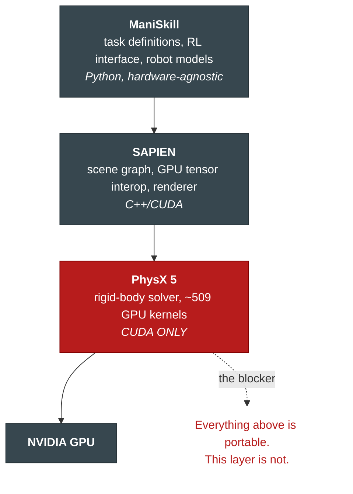
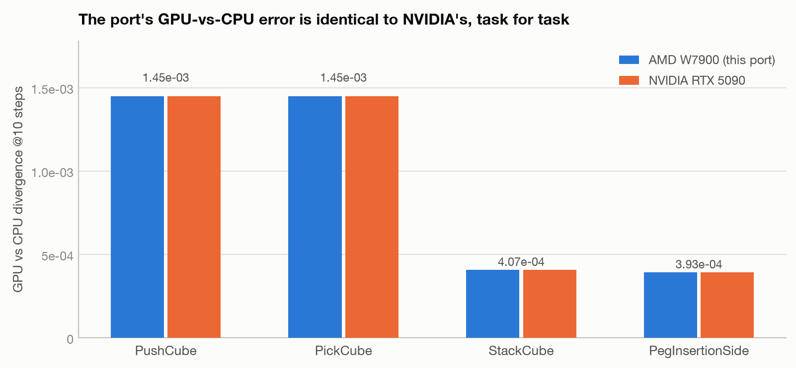
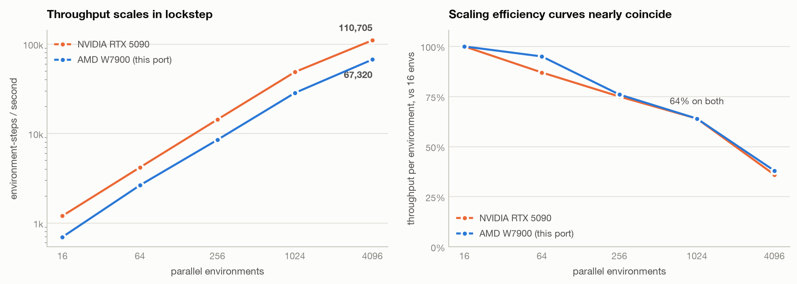
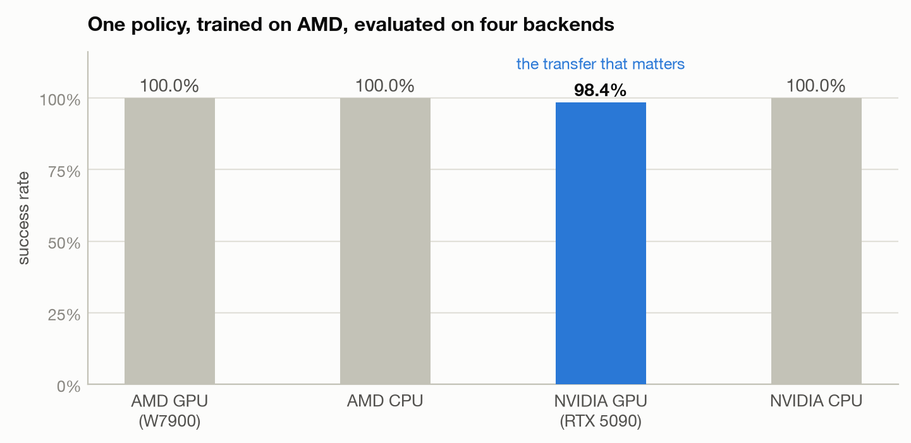
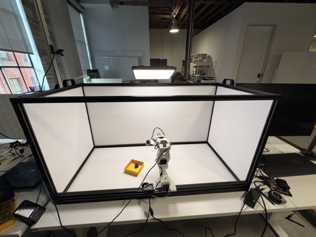
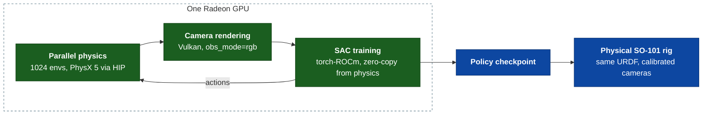
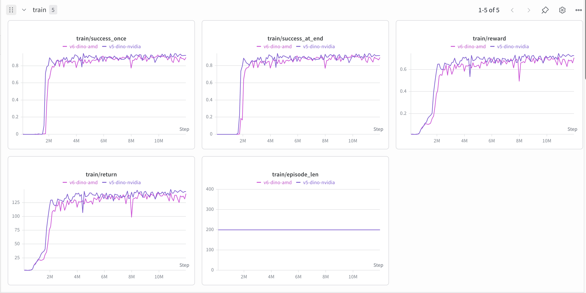
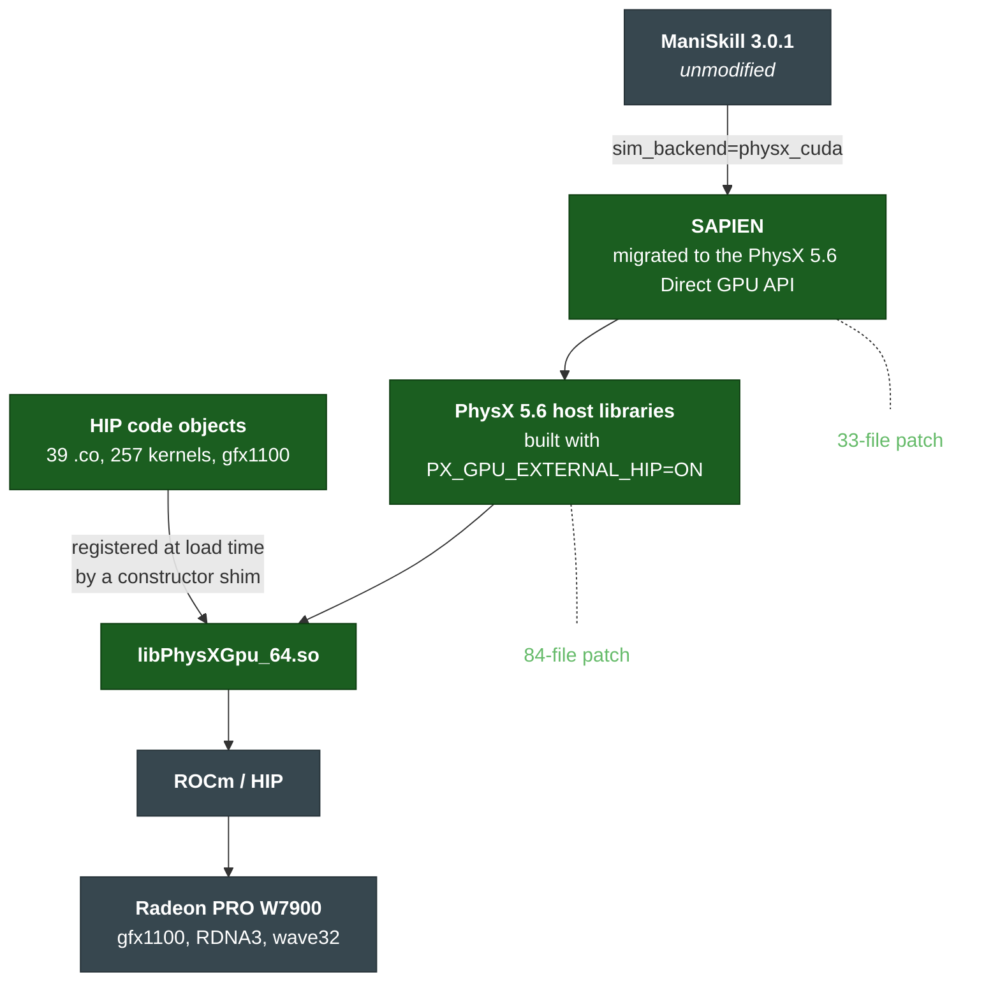

# Running ManiSkill on AMD: Porting the PhysX 5 GPU Physics Solver from CUDA to HIP

**Technical Report**

> I have a robot rig called SO-Frame, and I train its policies in simulation instead of collecting
> demonstration data by hand. That whole pipeline only ran on NVIDIA hardware, because the simulator
> I use is built on a physics engine whose GPU code is written in CUDA and nothing else.
>
> So I ported it. ManiSkill now runs GPU-parallel physics on an AMD Radeon at **60% of an RTX
> 5090's throughput**, with numbers **matching NVIDIA to three significant figures**, and a
> vision-based policy I trained end-to-end on a Radeon now drives my physical robot.
>
> The point is not the benchmark. It is that a whole branch of robotics research (ManiSkill, Isaac
> Gym, Isaac Lab) was locked to one vendor, and now some of it isn't.

|                        |                                                                              |
| ---------------------- | ---------------------------------------------------------------------------- |
| **Demo video**         | **https://www.youtube.com/watch?v=jH5PWRnx3-Q**                              |
| **Source code**        | **https://github.com/pham-tuan-binh/ManiSkill**                              |
| **Reproduction guide** | [`REPRODUCE.md`](REPRODUCE.md), including provisioning a Radeon from scratch |
| **Validated on**       | Radeon PRO W7900 (`gfx1100`, RDNA3), ROCm 7.2.1, Ubuntu 24.04                |
| **Reference platform** | NVIDIA RTX 5090, stock unpatched ManiSkill                                   |
| **Prior work**         | [SO-Frame sim2real, established on NVIDIA before this port](https://x.com/pham_blnh/status/2083319521348362747)           |

[](https://www.youtube.com/watch?v=jH5PWRnx3-Q)

_Demo video: the build, the benchmarks, and the AMD-trained policy running on the physical rig._

---

## 1. Introduction

### Why I needed this

For the past months I've been building a cheap, standardized robot rig called **SO-Frame**: an SO-101 arm on a linear rail, two cameras, a lightbox work surface. The thing I actually want from it
is for the robot to learn tasks by itself in simulation, rather than me collecting demonstration
data by hand for every new task.

That means training a policy inside a physics simulator, on camera images, and then running that
same policy on the real arm. People call this **sim2real**. It works, I got it working, and the
write-up of how is [a separate story](https://x.com/pham_blnh/status/2083319521348362747).

The part that concerns this report is boring and structural: **all of it only ran on NVIDIA.** Not
because of anything about robotics, but because of one library buried three layers down.

### Where the lock-in actually lives

The simulator I use is **ManiSkill 3**. Its whole selling point is that it runs thousands of copies
of your robot environment at the same time on one GPU. If you train a policy the normal way, one
environment at a time, you get a few hundred simulation steps per second and training takes days.
Run four thousand copies side by side on a GPU and you get tens of thousands of steps per second.
That difference is what makes learning from scratch practical instead of theoretical.

Here is the thing though. ManiSkill doesn't actually contain any physics. It's a Python layer that
defines tasks, robots and rewards, and it hands all the real work down a stack:



At the bottom is **PhysX 5**, NVIDIA's physics engine, and its GPU solver is written entirely in
**CUDA**. CUDA is NVIDIA's programming language for GPUs, and it only runs on NVIDIA GPUs. That's
the whole problem. Everything above that red box is ordinary portable code.

A bit of vocabulary, because the rest of this report leans on it:

- A **GPU kernel** is just a function that runs on the GPU, launched across thousands of threads at
  once. PhysX has about 509 of them for its GPU solver: one for sorting collision candidates, one
  for computing contacts between convex shapes, one for the constraint solver, and so on.
- **CUDA** is NVIDIA's language for writing those. **HIP** is AMD's equivalent, and **ROCm** is
  AMD's surrounding toolchain, roughly AMD's answer to the CUDA ecosystem.
- HIP is deliberately designed to look almost exactly like CUDA. Same function names, same syntax,
  mostly a one-to-one mapping. **That similarity is the only reason this project was feasible at
  all**, and the interesting parts of this report are all about where that similarity quietly
  breaks.

So "make ManiSkill run on AMD" reduces to a much narrower question: **can PhysX's GPU solver be made
to run on AMD without changing the shape of the data it produces?** The shape matters because
ManiSkill hands you GPU memory directly. When you ask it for the state of every robot in every
environment, you get a tensor that points straight into PhysX's own GPU buffers, 53 different
accessors, no copying. If I changed the memory layout, everything above would break.

### Why bother, when other simulators already run on AMD

To be fair about the landscape: robotics simulation on AMD is not a blank space. MuJoCo-MJX runs on
AMD through JAX, and Genesis runs on it too. If you just want *a* simulator on a Radeon, you have
options today.

What has no AMD path is the **PhysX family** (ManiSkill, Isaac Gym, Isaac Lab), because all of them
inherit the same CUDA-only solver. And that family is where most of the published manipulation
benchmarks, tuned task suites and baselines live. So this port doesn't open robotics simulation on
AMD. It opens *that branch* of it, which is the branch with all the prior work in it.

I want to bring existing robotics research from NVIDIA to AMD, and that starts with PhysX. It became
possible for the first time in March 2025, when NVIDIA released PhysX 5's GPU source code under a
BSD-3 licence.

### What this report covers

Results first, then how it works, then what it unlocks: the **benchmark** (§2), the **end-to-end
sim2real validation** on a real robot (§3), the **system architecture and solution** (§4), the
**implications** (§5), and how to **reproduce** all of it yourself (§6).

|                           | Result                                                                                                                       |      |
| ------------------------- | ---------------------------------------------------------------------------------------------------------------------------- | ---- |
| **Throughput**            | 67,320 env-steps/s at 4096 envs, **60% of an RTX 5090**, and the ratio stays flat across three orders of magnitude           | §2.2 |
| **Numerical correctness** | 15/15 validation on both platforms; the AMD-vs-CPU difference is **identical to NVIDIA's to three significant figures**      | §2.1 |
| **Policy transfer**       | A policy trained on AMD scores **98.4%** when evaluated on NVIDIA's stock CUDA PhysX                                         | §2.4 |
| **Sim2real**              | A vision-based policy trained entirely on a Radeon **drives the physical SO-101 rig**                                        | §3   |
| **Vision**                | Camera rendering works on AMD (`obs_mode="rgb"`), which took a second port of its own                                        | §4.4 |
| **Scope**                 | 257 of 509 kernels; ManiSkill itself **completely unmodified**                                                               | §4.2 |
| **Energy**                | NVIDIA is 1.43× more efficient; AMD gives 60% of the throughput inside 42% of the power budget                               | §2.3 |

---

## 2. Benchmark

Before any of the numbers, the obvious question: **how do you know a port is correct?**

You can't just check that the robot arm moves. Physics simulations are chaotic, tiny differences
compound, so "it looks right" is worth almost nothing. What I did instead was build a ladder of
tests where each rung catches something the one below it can't, ending at a real robot. §4.6 lays
out the full ladder; this section is rungs one to four, and §3 is the last one.

**A note on data.** There is no training dataset here, and that's deliberate. This is *online*
reinforcement learning: the policy generates its own data by acting in the simulator and seeing what
happens. That's precisely why simulation speed is the bottleneck, and precisely why this port is
worth doing. What is fixed is the set of tasks: `PushCube-v1`, `PickCube-v1`, `StackCube-v1` and
`PegInsertionSide-v1`, all built into ManiSkill 3.0.1, with the standard Franka Panda arm and each
task's own definition of success. I picked those four to stress different parts of the physics
engine rather than for variety: `PushCube` barely touches anything, `StackCube` is in the middle,
and `PegInsertionSide` has tight clearances that hammer the collision-detection code. Two of them
also exercise articulated bodies, which go through a completely different code path that I had to
migrate and check separately.

### 2.1 Numerical correctness



**The validation suite passes 15/15 on both platforms.** Determinism holds bit-identically across
four tasks (30 steps × 16 envs), there are zero non-finite values, and the worst quaternion error is
2.38e-07 on both. At step 1 the GPU-vs-CPU divergence is 1.370e-03 on AMD against 1.369e-03 on
NVIDIA.

Reading those results:

**Determinism** means running the same scenario twice with the same random seed gives byte-for-byte
identical results. That sounds trivial, but on a GPU it isn't. Thousands of threads writing to
shared memory in a slightly different order every run will produce slightly different answers. If
determinism holds, you've ruled out an entire family of race-condition bugs. This is also the test
that caught my worst bug, a buffer-stride mismatch in my SAPIEN migration.

**|q|−1** is a sanity check on rotations. Orientations are stored as quaternions, which must always
have length exactly 1. If the solver is corrupting memory or accumulating error, this drifts. It
doesn't: worst case 2.38e-07, identical on both vendors.

**GPU-vs-CPU** is the interesting measurement, and it is *not* zero. PhysX's GPU solver and its CPU solver
use different algorithms, TGS on the GPU and PGS on the CPU, so they genuinely disagree slightly.
That's expected and it's true on NVIDIA too. The result that matters is the comparison between
the two bars in each pair: run the exact same test on an RTX 5090 and you get a disagreement identical to AMD's, to
three significant figures. **So the difference belongs to ManiSkill's GPU pipeline, not to my port.**
That's the single most useful number in this report, because it turns "is my port wrong?" into a
question with a reference answer.

Also, PhysX's GPU sorting routine produces bit-identical output to NVIDIA at four different problem
sizes, and ManiSkill's CPU physics is bit-identical across platforms on six tasks.

### 2.2 Throughput



_(PushCube-v1. NVIDIA leads by 1.59× to 1.72× at every scale. "Scaling efficiency" is throughput per
environment relative to the 16-env case, so it shows how well each card keeps up as you pile on more
work.)_

**The flat ratio is the real result here, not the 1.67×.** If a port has one badly-behaved kernel or
some hidden bottleneck that serialises work, it doesn't degrade gracefully. It falls off a cliff at
some particular scale. This doesn't. It trails NVIDIA by a constant factor across three orders of
magnitude, and the two scaling curves nearly coincide (64% at 1024 envs on both cards). That's my
strongest evidence that the port is structurally sound rather than just functional.

**Please don't read 1.67× as "CUDA is 1.67× faster than ROCm".** The RTX 5090 has about 2.07× the
memory bandwidth of the W7900 (1,792 vs 864 GB/s) and roughly 1.7× the raw floating-point
throughput. GPU rigid-body physics is bound by memory bandwidth and latency, not by arithmetic. So
the measured gap sits *inside* the hardware gap, which tells you the port isn't leaving a big
multiple on the table, and tells you nothing about the two software stacks per unit of silicon.
There has also been **zero AMD-specific tuning**: thread-block sizes and shared-memory budgets are
still whatever NVIDIA's engineers chose. Treat 1.67× as a ceiling on the gap, not a floor.

### 2.3 Power and energy

I wanted this section to say AMD wins. It does not.

|                       | AMD W7900                    | NVIDIA RTX 5090                |
| --------------------- | ---------------------------- | ------------------------------ |
| Measurement boundary  | GPU **package** (`rocm-smi`) | total **board** (`nvidia-smi`) |
| Board/package limit   | 241 W                        | 575 W                          |
| Idle                  | 18.5 W                       | 38.9 W                         |
| Load @4096 envs       | 108.5 W                      | 126.5 W                        |
| Energy / 1M env-steps | 1,722 J                      | **1,207 J**                    |
| Efficiency            | 580 steps/s/W                | **829 steps/s/W**              |

**NVIDIA is more energy-efficient, by 1.43×.** That's a smaller gap than its 1.67× throughput lead,
because the W7900 draws considerably less power. AMD delivers 60% of the throughput inside 42% of
the power budget, which is a genuinely reasonable place to be.

But I have to flag that the two measurements aren't strictly comparable, and the incomparability
flatters AMD: `rocm-smi` reports the GPU package while `nvidia-smi` reports the whole board
including memory and regulators. So the real gap is *wider* than 1.43×. Correcting for idle draw
gives 1.71×, which is probably closer to the truth. A wall-socket meter would settle it and I didn't
have one.

One finding that's actually actionable: **efficiency roughly doubles going from 1024 to 4096
environments, on both cards** (AMD: 302 → 580 steps/s/W). If you're paying for electricity, use the
biggest batch that fits in memory.

### 2.4 Cross-platform policy transfer

This is my favourite test, because it's the one that can't be fooled by a tolerance I picked myself.

I trained a policy entirely on AMD, using the ported physics. Then I took that trained policy and
evaluated it on NVIDIA's completely stock, unmodified CUDA PhysX:



_(64 episodes on each GPU backend, 16 on each CPU backend. Mean return 41.57 / 41.74 / 39.92 / 40.20
left to right.)_

**98.4%.** Why this matters more than any per-step number: a trained policy is a closed loop. It
observes, acts, observes the consequence, acts again, for hundreds of steps. Small systematic
errors in contact or friction *accumulate* over an episode. A per-step tolerance of 1e-3 will happily
forgive a bias that completely destroys a policy fifty steps later. A policy surviving the move to
another vendor's physics engine is evidence that no such bias exists.

It's also the test that would have caught my worst buffer-layout bug immediately, because nothing can learn
a task from poses that are being read out of memory at the wrong offset.

Training throughput was 5,797 steps/s on AMD against 11,193 on NVIDIA. That's a 1.93× gap, wider
than the 1.67× physics gap, because training also runs neural networks and does CPU-side work, and
that particular NVIDIA host has a roughly 2× faster CPU.

---

## 3. End-to-end sim2real validation

Everything in §2 compares my port against other *software*: against itself, against a CPU
implementation, against another vendor's GPU. Here's the uncomfortable thing about that: **a port
could pass every single one of those tests and still be subtly wrong.** If the ported physics has
some systematic error, and I compare it against the same ported physics running elsewhere, both
sides reproduce the error identically and everything looks fine.

The only way out is an oracle that lives outside the simulator. A real robot.

### What SO-Frame is



_The physical rig. Diffuse lightbox work surface, the arm on its rail, and the task in front of it:
a small cube to pick up and a bin to drop it in._

[SO-Frame](https://github.com/livekit-examples/so-frame) is my rig: an **SO-101 5-DOF arm mounted on a linear rail** (7 actuated joints total), with
a wrist camera that follows the gripper and a static overhead camera looking down at the work
surface. Everything (arm, rail, cameras, frame) is described by one URDF file, so the simulated
twin and the real rig share identical kinematics and identical camera mounts.

The task is to pick up a small cube and place it in a bin. The policy is **vision-based**: it sees
only the two camera images plus its own joint positions, exactly as it would on the real robot. It's
trained with SAC (an RL algorithm) on top of a frozen DINOv2 vision encoder.

▶ **[Rollouts in simulation on the Radeon](assets/sim_amd.mp4)** (20 s): physics and camera
rendering both running on the ported stack.

The important property for *this* report is that **SO-Frame's sim2real transfer was already
established on NVIDIA before this port existed.** I had already tuned that environment until a
policy trained in it drove the physical rig, and [wrote that work up separately](https://x.com/pham_blnh/status/2083319521348362747). That makes it a test whose acceptable error is set by a
real robot rather than by a threshold I invented. If my port introduced a dynamics error big enough
to matter for manipulation, an environment already tuned to the edge of transferring is exactly
where it would show up.

### What had to work on one GPU



Each green box was its own blocker. Physics, because PhysX's solver was CUDA-only, and that's the bulk
of this project. Training, because the policy and the physics have to live on the same GPU with no
round-trip through the CPU, or you lose all the speed you just gained.

And rendering, which is the one people underestimate. **My policy learns from camera images.** If
the simulator can't draw those images on AMD, the loop breaks at step two and nothing else matters.
SAPIEN's renderer shares images with the compute side through a Vulkan↔CUDA bridge that had no AMD
equivalent, so I had to port that too (§4.4). That's why this is a sim2real port and not just a
physics port.

### 3.1 Status

| Stage                                                                                            | Status                              |
| ------------------------------------------------------------------------------------------------ | ----------------------------------- |
| Environment resolves and installs on AMD, upstream `mani_skill` 3.0.1, no project source changes | **done**                            |
| GPU physics under the port, with the GPU confirmed genuinely in use                              | **done**                            |
| Camera rendering returns real frames on the Radeon                                               | **done**                            |
| Scene reconfiguration stable (the render bridge survives a teardown/rebuild)                     | **done**                            |
| Rollout collection at 1024 envs, two 168×168 cameras                                             | **done**, ~70 env-steps/s sustained |
| SAC gradient updates on AMD                                                                      | **done**                            |
| Full training run on AMD, past 11M environment steps                                             | **done**                            |
| AMD-trained policy drives the physical rig                                                       | **done**, qualitative               |
| Head-to-head evaluation against the NVIDIA-trained baseline                                      | not run                             |

**A vision-based policy trained end-to-end on a Radeon, with physics, rendering and SAC updates all on
one card, drives the physical SO-101 rig.** The entire loop in that diagram closes on AMD hardware.
That's the result I care about most, because it's the one that couldn't have been faked by a
plausible-looking but wrong port.

▶ **[The AMD-trained policy on the physical rig](assets/real_rollout.mp4)** (56 s, unedited), or
watch the [full demo on YouTube](https://www.youtube.com/watch?v=jH5PWRnx3-Q).

Two things I'm deliberately *not* claiming. First, the rig result is **qualitative**. I watched the
AMD-trained policy do the task on real hardware, but I didn't log trial counts or a success rate, so
there's no number here and I'm not going to invent one. Second, I **didn't run the controlled
comparison**: evaluating the AMD-trained and NVIDIA-trained checkpoints back to back in the same
simulator. So I can say the AMD policy works, not that it matches the NVIDIA baseline. That's one
command and it's the obvious next thing to do:

```bash
# evaluate BOTH checkpoints in the SAME simulator
uv run python train.py --eval-only --checkpoint <amd.pt>
uv run python train.py --eval-only --checkpoint <nvidia-baseline.pt>
```

### 3.2 The training run

I trained the same task on both platforms and plotted them together: `v6-dino-amd` under this port,
against `v5-dino-nvidia`, the established NVIDIA run.



**The two curves are the same curve.** Both sit at zero until roughly 1.7M steps, both rise almost
vertically over the next few hundred thousand, and both settle into the same band and stay there out
past 11M. NVIDIA takes off marginally earlier, crossing 0.8 at about 1.8M against AMD's 2M, and holds
a small lead for the rest of the run: on `train/success_once` AMD plateaus around 0.88 to 0.90 where
NVIDIA sits around 0.90 to 0.93. `train/return` and `train/reward` show the same shape and the same
small offset, and `episode_len` is pinned at the 200-step cap on both.

That gap of a couple of points is the most interesting number here, because **it is roughly what I
predicted in advance and for the reason I predicted.** The deviations below were written down before
the run finished, and the one I flagged as most likely to matter, the shorter replay buffer, is a
sample-efficiency penalty. A small persistent shortfall is exactly the shape that predicts. What it
is *not* is a correctness problem: a port with broken dynamics does not produce a learning curve
that tracks the reference this closely for 11M steps.

One caveat on reading the chart: these are **training** metrics, logged during rollout collection,
so they run noisier and lower than a clean evaluation pass would. Otherwise the comparison is clean.
The `v5` and `v6` tags are run labels, not different code, so apart from the three deviations listed
below the platform is the only thing that differs between the two curves.

**Three ways this run differs from the baseline**, all forced by hardware, all stated up front
because each one could change the outcome:

|                  | NVIDIA baseline  | This run             | Why                                                                                          |
| ---------------- | ---------------- | -------------------- | ---------------------------------------------------------------------------------------------- |
| replay retention | 2.0 episodes/env | **1.5 episodes/env** | VRAM: 48 GB card vs 96 GB                                                                    |
| `torch.compile`  | on               | **off**              | Segfaults deterministically at iteration 8                                                   |
| throughput       | 341 steps/s      | **~70 steps/s**      | ~1.67× hardware, ~1.46× from losing compile, the rest from render/compute not overlapping (§4.4) |

On the replay buffer: this is the memory of past experience that an off-policy algorithm like SAC
learns from. Keeping 2.0 episodes per environment needs 42.2 GiB on a 48 GiB card, which fails on
memory fragmentation with only ~0.5 GiB of slack, and host RAM was not a usable fallback on this
machine.

Retention is the deviation most likely to matter: a 25% shorter memory is less sample-efficient, so
this run might not hit the baseline's success rate at the same step count. That is what happened,
and by a couple of points. It's a consequence of having a smaller card rather than a defect in the
port: the buffer scales with environments × horizon × retention no matter whose silicon holds it.

### 3.3 The port is usable, not just correct

SO-Frame is also the cleanest evidence that this is adoptable rather than a science project. **The
codebase runs on AMD without changing a single line of its own source.** Its
**[`amd` branch](https://github.com/livekit-examples/so-frame/tree/amd)** carries everything needed to run against this flavour of ManiSkill,
and the diff against `main` is dependency pins only: the ROCm torch index, matching torchvision and
triton, and the install step that drops the AMD-capable libraries into the venv. `mani_skill` itself
stays the unmodified 3.0.1 release straight from PyPI.

That falls out of where the port lives. Because everything I changed is in PhysX and SAPIEN, below
ManiSkill rather than inside it, a downstream project just depends on released ManiSkill and has the
AMD-capable libraries installed underneath it (`install-into.sh <venv>`). There's no fork to track
and no patches to rebase.

---

## 4. System architecture and solution

### 4.1 Why port PhysX instead of switching simulators

The obvious alternative was to drop PhysX and use a physics engine that already runs on AMD, like
MuJoCo-MJX or Genesis. Both are real, working options, so this was a genuine decision and not a
strawman. I rejected it for one reason: **it destroys the test oracle.**

Here's what I mean. With the same engine on both platforms, same integrator, same random seed, any
difference between AMD and NVIDIA is a *bug*, and I can go find it. With a different engine,
differences are *expected*, so when a policy fails, I can never tell whether it's a porting bug, a
genuine difference in how the two engines model contact, or a task that needs retuning. That's
undebuggable, and for a simulator whose entire value is physical fidelity, undebuggable is
disqualifying.

Every number in §2 exists because of that choice. The "identical to three significant figures"
result is only meaningful because both sides run the same algorithm.

Porting also preserves what people actually depend on: every task's tuned physics parameters, every
published baseline, and all 53 zero-copy buffer accessors.

### 4.2 What I actually ported

| Layer                   | Work                                                                        |
| ----------------------- | --------------------------------------------------------------------------- |
| **PhysX GPU kernels**   | 257 of 509 kernels (95 of 123 files) recompiled CUDA → HIP for gfx1100      |
| **Warp-primitive shim** | ~886 call sites made HIP-safe (§4.5)                                        |
| **PhysX host layer**    | CUDA driver-API surface mapped to HIP; module registration replaced         |
| **SAPIEN**              | Migrated from PhysX 5.3's packed GPU API to 5.6's Direct GPU API (33 files) |
| **ManiSkill**           | **Zero changes for physics.** One unrelated rendering fix                   |

I ported 257 of the 509 kernels, not all of them. The ones I skipped handle cloth, fluids,
deformable bodies and soft-body simulation, none of which ManiSkill's rigid-body manipulation tasks ever launch
any of them. There are exactly **247 such kernels**, which I counted from a working run rather than
guessing, because every scene logs a `[critical]` message for each one it can't find. None of them
are fatal, and a fully passing 15/15 validation run prints all 247 of those messages, which makes a
perfectly healthy system look alarming the first time you see it.

### 4.3 How the port is put together



Three design decisions carry most of the weight.

**I used a compile-time shim instead of rewriting the source.** There's a header file,
`hip_warp_compat.h`, that redefines the problematic CUDA functions in terms of their HIP
equivalents (§4.5 explains what makes them problematic). That handles roughly 886 call sites without
editing any of them. The payoff is that my port stays a *thin patch* I can rebase onto a future
PhysX release, rather than a fork that slowly rots as upstream moves on.

**I register kernels by reading the compiled files directly.** This one needs a little background.
When you compile CUDA, the compiler quietly inserts calls that announce each kernel to the runtime
by name, and PhysX hooks those calls to build its own name→kernel lookup table. HIP's compiler emits
a different, incompatible set of announcements. Rather than fight that, I have a small function that
runs when the library loads, opens the compiled kernel files, and registers each kernel with PhysX
through its public API, reading the names out of the binary's symbol table. PhysX never finds out
the kernels didn't come from NVIDIA's compiler.

**Parallelism was never my problem to solve.** This one is unchanged from upstream but worth saying
because it's why the whole project is tractable: ManiSkill's "4096 parallel environments" are not
4096 separate simulations. They're 4096 copies laid out in different places within *one* PhysX
scene, stepped by one set of kernel launches. The parallelism lives inside the kernels. So porting
the kernels is sufficient, and I never had to write a scheduler.

### 4.4 How the AMD GPU actually gets used

This is not a compatibility wrapper or a translation layer at runtime. The Radeon does the same work
the NVIDIA card does, through the same memory buffers.

**Simulation.** Every `env.step()` runs the full PhysX GPU pipeline as HIP kernels: broadphase
sorting, narrowphase collision detection between convex shapes, contact generation, constraint
preparation, the batched solver, articulation dynamics, integration. At 4096 environments that's
62,960 to 67,320 environment-steps per second.

**Training.** PPO and SAC both run entirely on the Radeon, and critically there's **no round-trip to
the CPU** between physics and the neural network. The observations the policy reads are PyTorch
tensors that point directly at PhysX's GPU memory. Making that work meant swapping one constant.
The tensor-sharing standard PyTorch uses has a field saying which kind of device the memory lives
on, and it needed to say "AMD" instead of "NVIDIA".

**Inference.** Evaluating a trained policy uses the same zero-copy path, so it runs at full
simulation speed.

**Rendering.** Camera images work on AMD, which took a whole second port of its own: the
renderer is Vulkan while the physics and the network are HIP, and sharing an image between them
without a trip through the CPU needed a bridge that only existed for CUDA. Verified working:
`frame (2, 512, 512, 3) uint8, 222 distinct values`, with the default render backend. Three limits
remain: synchronisation happens on the CPU so rendering and compute don't overlap, one
texture-import function isn't available in ROCm 7.2.1, and there's no denoiser because that's an
NVIDIA-only library. The physics benchmarks in §2 deliberately turn rendering off, because
otherwise you're benchmarking Vulkan.

### 4.5 An interesting bug: divergent warp masks

This is the finding I care about most, and it applies far beyond ManiSkill.

First, background. GPU threads don't execute independently. They run in lockstep groups. NVIDIA
calls a group a **warp** (32 threads); AMD calls it a **wavefront**. Because the threads in a group
run together, they can share data with each other very cheaply, and CUDA exposes functions for
that: `__shfl_sync`, `__ballot_sync` and friends. Each takes a **mask** saying which threads in the
group are participating.

Now, the catch. If your code is inside an `if` statement, only some threads are actually running and
the rest are dormant. If you pass a mask naming those dormant threads, the CUDA specification says
the behaviour is undefined. **On NVIDIA hardware it works anyway**, because the hardware quietly
reconverges the threads. So a huge amount of CUDA code in the wild does this, and nobody ever finds
out.

PhysX does it at roughly 886 places. On AMD's gfx1100 it doesn't quietly work. It raises a
**hardware exception** (`HSA_STATUS_ERROR_EXCEPTION`, code `0x1016`) that kills the entire GPU
command queue. I measured both platforms on identical source:

| Case                                                | RTX 5090 (sm_120) | W7900 (gfx1100)                       |
| --------------------------------------------------- | ----------------- | ------------------------------------- |
| `__shfl_sync(FULL_MASK, …)` inside `if (lane < 16)` | works             | **traps**                             |
| `__syncwarp(mask)`                                  | works             | **traps** (both 32- and 64-bit masks) |

I was not about to hand-edit 886 call sites. The shim intercepts each of those functions and clamps
the mask against `__activemask()`, the set of threads genuinely running right now, so a mask can
never name a dormant thread. For `__syncwarp` it substitutes a lightweight wavefront barrier.
Deliberately *not* `__syncthreads()`, which would also work and would also synchronise the entire
thread block, destroying performance in exactly the divergent code you're trying to fix. Validated
12/12 on both platforms.

**Why this generalises:** any CUDA codebase that leans on NVIDIA's tolerance here will hit the same
wall, and the bug is completely invisible on the platform it was written for. The header is a
reusable answer to a class of bug, not a one-off patch.

One piece of luck worth naming. RDNA3 uses 32-thread wavefronts, the same width as NVIDIA's warps.
That removed the single largest risk in this project. AMD's datacenter architecture, CDNA, uses 64,
and every assumption about 32 lanes in those 886 sites would be wrong. Worse, it would be *silently*
wrong: you'd get bad physics rather than a crash.

### 4.6 The validation ladder

Everything above rests on a ladder of tests, where each rung catches something the rung below it
cannot:

| Rung                                                 | Compared against                 | What it catches                                                              |
| ---------------------------------------------------- | -------------------------------- | ---------------------------------------------------------------------------- |
| **1. Determinism**: same seed twice, bit-identical   | the port vs itself               | Races and uninitialised memory. Caught a buffer-stride bug immediately.           |
| **2. Invariants**: finite, unit quaternions, bounded | the port vs physical law         | Exactly what tripped PhysX's own assertion, measured rather than waited for |
| **3. GPU vs CPU vs a size-matched noise floor**      | the port vs a CPU reference      | Solver errors, separated from ordinary chaos                                 |
| **4. Policy transfer across platforms**              | the port vs NVIDIA's PhysX       | Accumulated bias that per-step tolerances forgive                            |
| **5. A task with known sim2real behaviour**          | the port vs **a physical robot** | Errors that are self-consistent inside the simulator                         |

Rungs 1 to 4 are §2. Rung 5 is §3, and it's the only one whose oracle isn't software.

Rung 3 needs one note, because getting it right is less obvious than it looks. In a chaotic system
the final divergence between two runs scales with how far apart they *started*, so a noise floor is
only meaningful if it is size-matched. GPU-vs-CPU doesn't start at zero, it starts at 1.37e-03,
which is simply the cost of two different solver algorithms. Measured against a properly matched
1e-3 reference, the GPU sits at 0.39 to 1.45×, which is where it should be.

---

## 5. Implications and impact

**Published work becomes checkable on different silicon.** The PhysX family (§1) is no longer
single-vendor: work that used to need NVIDIA hardware to reproduce now runs on a Radeon at 60% of an
RTX 5090's throughput, inside 42% of its power budget, with numbers matching the reference to three
significant figures.

A benchmark that only runs on one vendor's hardware is a benchmark nobody can independently verify
without buying that vendor's hardware. Since ManiSkill itself is untouched and everything I changed
lives underneath it, adopting this means changing dependency pins, not source code. The cost of
re-running someone else's published experiment on AMD is close to zero.

**The warp-mask finding is bigger than this project.** NVIDIA tolerates masked warp intrinsics that
name inactive threads; RDNA3 raises a hardware exception and kills the queue. Any CUDA codebase
that's been relying on that tolerance (and since it's invisible on NVIDIA, a codebase can rely on
it without anyone knowing) will hit the same wall on AMD. `hip_warp_compat.h` is a reusable answer.

**Where the headroom is.** There has been no AMD-specific tuning whatsoever: thread-block geometry
and shared-memory budgets are still NVIDIA-shaped, which makes the 1.67× gap in §2.2 a ceiling
rather than a floor. Someone who actually profiles this on AMD should be able to close some of it.

The most valuable next step is **CDNA (MI200/MI300)**, which my build currently refuses outright.
Those use 64-thread wavefronts, so every 32-lane assumption in the 886 shimmed call sites is wrong,
and the failure mode is silently incorrect physics rather than a crash, which is why refusing is
the right behaviour for now. Datacenter AMD is where this would matter most, and it's genuinely
unsolved rather than merely unfinished.

---

## 6. Reproduction

Everything here is reproducible from the repository, on a Radeon you can rent by the hour.
**[`REPRODUCE.md`](REPRODUCE.md)** is the full guide: it starts from having no AMD card at all, walks
through provisioning one on AMD Radeon Cloud, and ends with a JSON file of benchmark numbers. Budget
about three hours, most of it unattended compilation.

```bash
git clone https://github.com/pham-tuan-binh/ManiSkill.git && cd ManiSkill
./tools/amd_port/bootstrap.sh --prebuilt --fix-torch-rocm --venv benchmarks/amd/.venv
source ~/maniskill-amd/env.sh
./tools/amd_port/verify.sh          # 15/15 correctness, GPU liveness checked first
cd benchmarks && uv run amd         # throughput + power -> results/amd-latest.json
```

### Deliverables

| Deliverable                                                                        | Location                                                             |
| ------------------------------------------------------------------------------------ | ---------------------------------------------------------------------- |
| **The port as patch files**, verified to rebuild the validated trees byte-for-byte | `tools/amd_port/bundle/{physx,sapien}-amd-hip.patch` (84 + 33 files) |
| **Prebuilt gfx1100 kernels**, so you can skip the long compile                     | `tools/amd_port/bundle/artifacts-gfx1100.tar.gz` (3.2 MB)            |
| **One-command build and verification**, 7 stages, resumable, self-verifying        | `tools/amd_port/bootstrap.sh`, `verify.sh`                           |
| **Benchmark harness**, identical code on both platforms, JSON output               | `benchmarks/` → `uv run amd` / `uv run nvidia`                       |
| **Installer for existing projects**, ABI-checked                                   | `tools/amd_port/install-into.sh`                                     |

Docker images for both platforms are in `docker/` and both build, but **`docker run` against an AMD
GPU has never been executed**. A Radeon Cloud instance is itself an unprivileged container and
can't run Docker at all. So there's deliberately no container-based reproduction path here. The
source build is the one with hardware evidence behind it.

**Output forms:** a working `sim_backend="physx_cuda"` on AMD; machine-readable benchmark JSON with
full provenance, including the resolved ManiSkill import path so it's provable which side used
upstream code and which used mine; trained policy checkpoints; and a reproducible build from pinned
upstream revisions.

---

## 7. Team

A one-person team, working with an AI coding assistant.

|                        | Role                                                                                                       |
| ---------------------- | ---------------------------------------------------------------------------------------------------------- |
| **Binh Pham**          | All engineering decisions and test design. Project direction and scope, hardware provisioning, and review. |
| **Claude** (Anthropic) | Implementation under that direction.                                                                       |

**On AI assistance.** I'd rather state this plainly than leave it implicit. The architecture, the
scope, every engineering decision and the design of the validation were mine. The assistant did
implementation, debugging and measurement under that direction.

Every number in this report was measured on real hardware by scripts included in the repository, and
[`REPRODUCE.md`](REPRODUCE.md) will reproduce them.
